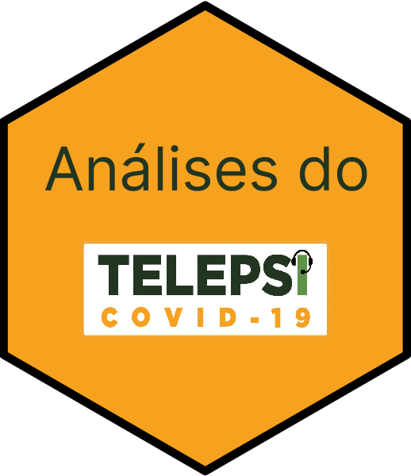

<!-- README.md is generated from README.Rmd. Please edit that file -->

# Análises de psicoeducação em vídeo para tratamento de queixas emocionais a partir de dados do projeto *TelePSI* 

TelePSI trata-se de um projeto de pesquisa que ofereceu psicoterapia
online, de modo gratuito, para todo o Brasil.

O projeto é fruto de uma parceria entre o Ministério da Saúde e o
Hospital de Clínicas de Porto Alegre, e teve como objetivo:

- Assistir a profissionais da saúde do Sistema Único de Saúde (SUS) com
  sofrimento emocional no período de pandemia.

O presente repositório tem como meta armazenar as análises provenientes
de um projeto aninhado que visa verificar a resposta de tratamento para
depressão, ansiedade, irritabilidade e *burnout* através de
psicoeducação por vídeo.

## Instalação

O presente pacote pode ser instalado através da seguinte forma:

``` r
install.packages(remotes) # Caso não tenha o pacote remotes instalado
remotes::install_github("brunomontezano/TelePsi")
```

## Contato

Para contatar o responsável pelas análises apresentadas neste
repositório em específicado, enviar email para <bmontezano@hcpa.edu.br>
